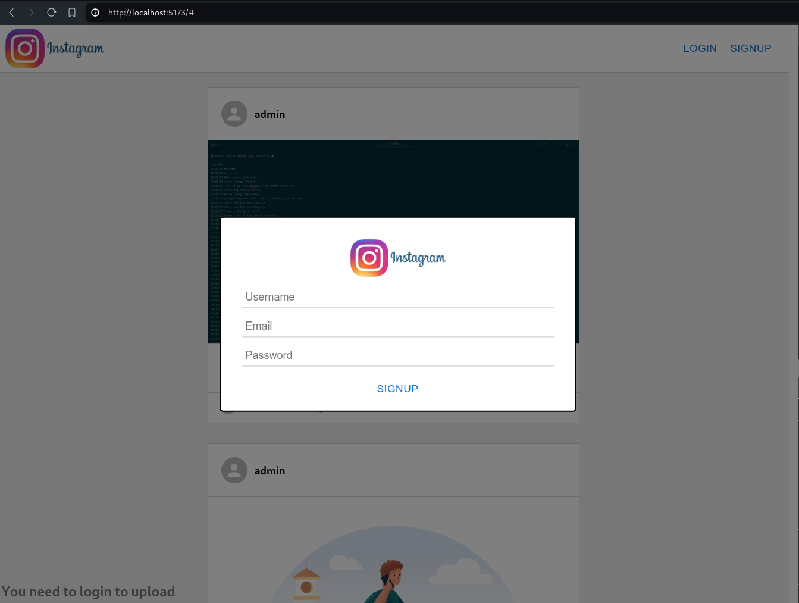
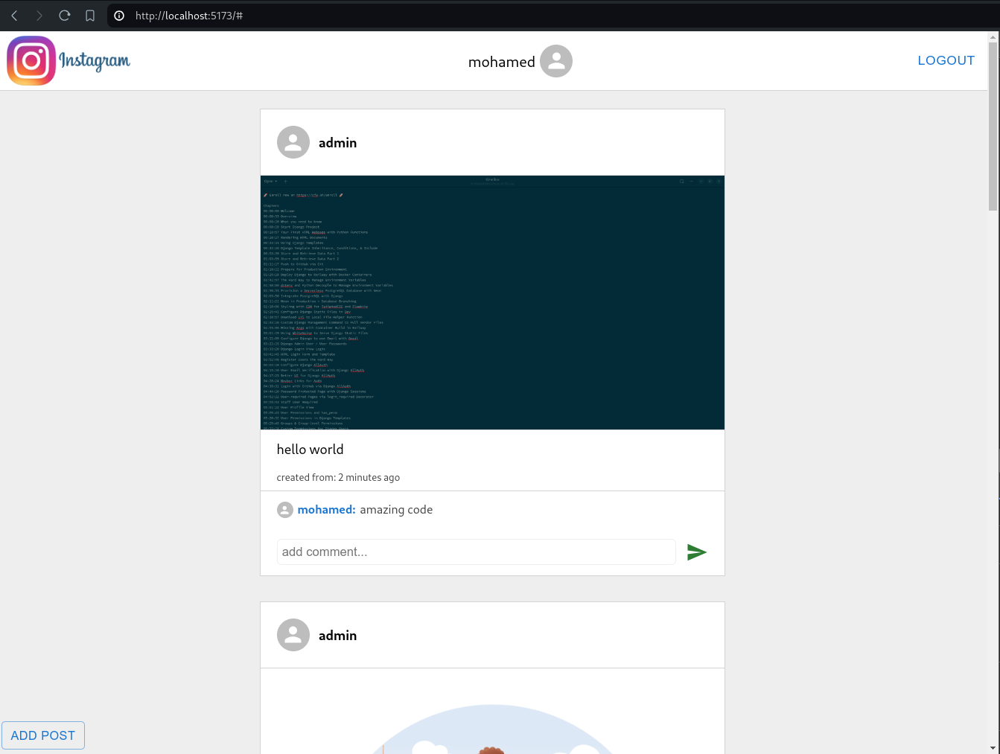
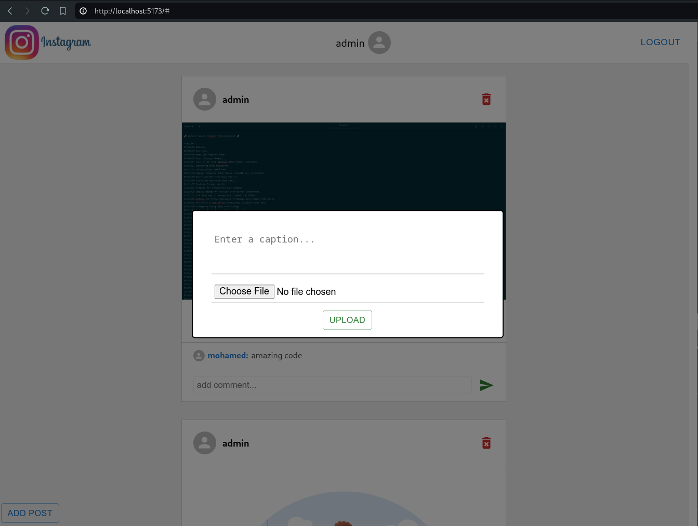

# Simple Instagram Clone
This project is a simple Instagram-like application built using FastAPI for the backend and React for the frontend. The application allows users to sign up, log in, post images, view posts, and comment on posts.

### Features
- User Authentication (Sign up, Log in, Log out)
- Post Images
- View Posts
- Delete Posts
- Comments System

### Technologies Used
- Backend: FastAPI, SQLAlchemy, Postgres
- Frontend: React, JS, CSS, Material-UI
- JWT (Json Web Token)
- Other Tools: Docker (for containerization)

### Getting Started
- Python 3.8+
- Node.js 14+
- Docker (optional, for containerization)

### Backend Setup
1. Clone the repository:
    - `git clone git@github.com:mohamedElbalky/instagram_FastAPI_React.git`
    - `cd instagram_FastAPI_React/backend`
2. Create a virtual environment and activate it:
    - `python -m venv venv`
    - `source venv/bin/activate`
3. Install the dependencies:
    - `pip install -r requirements.txt`
4. Run the FastAPI server:
    - `cd src/`
    - `python main.py`
5. To open Endpoints Documentation
    - Open in Browser: [http://127.0.0.1:8000/docs](http://127.0.0.1:8000/docs) 

### Frontend Setup
1. Navigate to the frontend directory:
    - `cd ../../frontend`
2. Install the dependencies:
    - `npm install`
3. Run the React development server:
    - `npm run dev`
4. Open in browser:  [http://127.0.0.1:8000](http://localhost:3000) 

### Running with Docker
- Build and run the Docker containers:
    - `docker-compose up --build`

### Images

    

        <h4>register: </h4>
        
    

    

        <h4>Login: </h4>
        
    

    

        <h4>Main: </h4>
        
    

    

        <h4>Add post: </h4>
        
    

